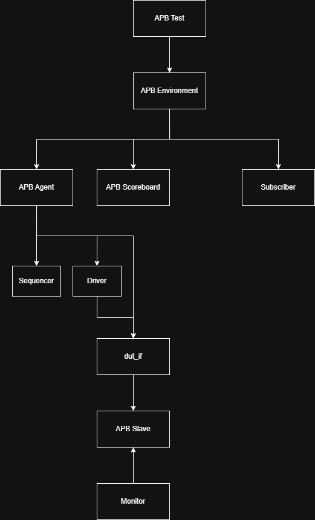

# APB UVM Verification Environment

A UVM-based verification environment developed in **SystemVerilog** to verify an **AMBA APB (Advanced Peripheral Bus)** slave. The project demonstrates the implementation of a reusable UVM testbench capable of generating randomized APB transactions, driving protocol-compliant bus activity, monitoring interface signals, checking functional correctness using a scoreboard, and collecting functional coverage.

---

## Project Overview

The Advanced Peripheral Bus (APB) is part of the ARM AMBA protocol family and is widely used for connecting low-bandwidth peripherals such as UARTs, GPIOs, Timers, Watchdog Timers, and SPI controllers within an SoC.

This project implements a complete UVM verification environment to verify an APB slave supporting both READ and WRITE operations.

---

## Key Features

- Randomized APB READ and WRITE transaction generation
- UVM Factory-based component creation
- Virtual Interface communication
- UVM Config Database usage
- Driver implementing APB SETUP and ACCESS phases
- Passive monitor with protocol checking
- Scoreboard with reference memory model
- Functional coverage using UVM Subscriber
- Reusable UVM architecture

---

## APB Protocol

The APB protocol transfers data using two phases:

### SETUP Phase

- PSEL = 1
- PENABLE = 0
- Address and control signals become valid

### ACCESS Phase

- PSEL = 1
- PENABLE = 1
- Data transfer occurs
- Transaction completes when **PREADY = 1**

---

## UVM Testbench Architecture

<p align="center">
  
</p>

---

## Verification Flow

1. The sequence generates randomized APB transactions.
2. The sequencer forwards the transactions to the driver.
3. The driver converts transaction objects into APB bus activity.
4. The APB slave executes the requested READ or WRITE operation.
5. The monitor observes the interface and reconstructs transactions.
6. The scoreboard verifies DUT functionality using a reference memory model.
7. The subscriber samples functional coverage.

---

## Project Directory

```text
APB-UVM-Verification
│
├── rtl
│   ├── dut_if.sv
│   └── apb_slave.sv
│
├── tb
│   ├── apb_transaction.sv
│   ├── apb_sequence.sv
│   ├── apb_sequencer.sv
│   ├── apb_driver.sv
│   ├── apb_monitor.sv
│   ├── apb_agent.sv
│   ├── apb_scoreboard.sv
│   ├── apb_subscriber.sv
│   ├── apb_env.sv
│   ├── apb_test.sv
│   └── top.sv 
│
├── docs
├── images
├── waves
└── README.md
```

---

## Verification Components

### Transaction
Defines the APB transaction object containing randomized address, data, and transaction type (READ/WRITE).

### Sequence
Generates randomized APB transactions and sends them to the sequencer.

### Sequencer
Transfers sequence items from the sequence to the driver.

### Driver
Implements APB protocol timing by driving SETUP and ACCESS phases onto the DUT interface.

### Monitor
Passively observes APB bus activity, reconstructs transactions, performs protocol checks, and broadcasts transactions through an analysis port.

### Agent
Groups the sequencer, driver, and monitor into a reusable verification component.

### Environment
Instantiates and connects the agent, scoreboard, and subscriber.

### Scoreboard
Implements a reference memory model to verify READ and WRITE transactions.

### Subscriber
Collects functional coverage for APB address and data transactions.

### Test
Creates the environment and starts the randomized APB sequence.

---

## Functional Coverage

Functional coverage is collected using a UVM Subscriber.

Current coverpoints include:

- Address
- Data

Future enhancements:

- READ/WRITE operation coverage
- Address × Transaction Type cross coverage

---

## Simulation Results

The verification environment successfully executed randomized APB read and write transactions.

The scoreboard verified data integrity by comparing DUT responses against the reference memory model.

Protocol compliance was monitored throughout simulation.

Waveforms demonstrating successful APB transactions are available in the `waves/` directory.

---

## Simulation Waveforms

### APB Read and Write Transaction

The following waveform demonstrates successful APB WRITE transactions followed by READ transactions to the same randomized address. The returned `PRDATA` matches the previously written `PWDATA`, confirming correct APB slave functionality and successful scoreboard verification.The waveform demonstrates APB SETUP and ACCESS phases, protocol handshaking, successful memory update during WRITE operations, and correct data retrieval during subsequent READ operations.

<p align="center">
  
</p>

---

## Future Improvements

- SystemVerilog Assertions (SVA)
- APB Error Response (PSLVERR)
- Wait-State Verification
- Directed Testcases
- Functional Coverage Expansion
- Multiple APB Slave Support

---

## Technologies Used

| Category | Technology |
|----------|------------|
| HDL | SystemVerilog |
| Verification Methodology | UVM 1.2 |
| Bus Protocol | AMBA APB |
| Verification Techniques | Constrained Random Verification |
| Functional Checking | Scoreboard |
| Coverage | Functional Coverage |

---

## Skills Demonstrated

- SystemVerilog
- Universal Verification Methodology (UVM)
- AMBA APB Protocol
- Constrained Random Verification
- Functional Coverage
- Scoreboard-based Verification
- Analysis Ports
- Virtual Interfaces
- UVM Factory
- UVM Configuration Database
- Transaction-Level Modeling (TLM)

---

## Author

**Nikhil P Jinan**

Electronics and Communication Engineering Graduate

Aspiring Design Verification Engineer

---
